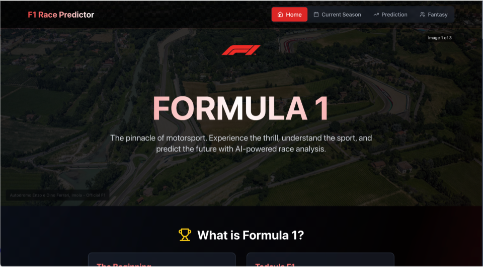
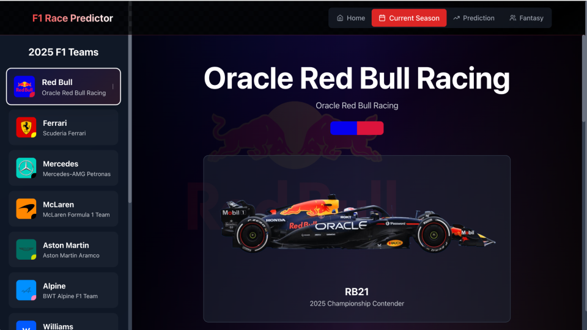
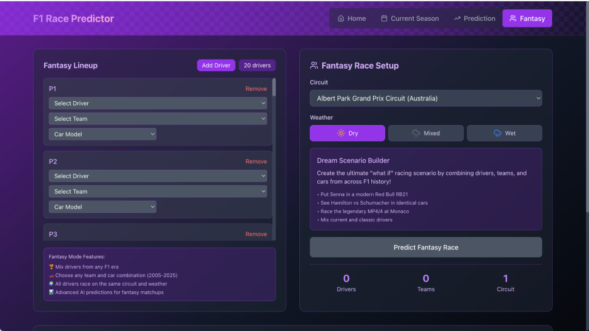

# 🏎️ F1 Race Predictor

> Modern Formula 1 race outcome prediction using machine learning with a React TypeScript frontend and Flask backend

[](https://reactjs.org)
[](https://typescriptlang.org)
[](https://python.org)
[](https://flask.palletsprojects.com)
[](LICENSE)

## 🏁 Overview

F1 Race Predictor is a comprehensive machine learning application that predicts Formula 1 race outcomes using advanced algorithms and real-world racing data. The system features a modern React TypeScript frontend with F1-themed design and a Flask backend API for race predictions.

### ✨ Key Features

- 🧠 **Machine Learning Predictions**: Multi-factor race outcome prediction
- 🌦️ **Weather Integration**: Dry, wet, and mixed conditions modeling
- 🏎️ **Interactive Grid Setup**: Configure starting positions and pit lane starts
- 📊 **Real-time Results**: Live prediction updates with win probabilities
- ⚛️ **Modern Frontend**: React TypeScript with F1 theming and checkered flag design
- 🎮 **Fantasy F1 Mode**: Budget-based team builder (coming soon)
- 📱 **Responsive Design**: Works seamlessly on desktop and mobile
- 🏆 **2025 Season Ready**: Updated with current teams and drivers

## 🎯 Application Features

### **🏠 Homepage**
- F1 introduction and rules explanation
- Historical statistics and championship data
- Checkered flag background with F1 branding
- Educational content about Formula 1

### **🏎️ Current Season (2025 Teams)**
- Interactive team browser with all 10 F1 teams
- Detailed team information (principal, base, championships)
- Driver cards with current 2025 lineup
- Team logos and color schemes
- **Fixed**: Sidebar scroll preservation on team selection

### **🔮 Prediction Interface**
- Complete race setup with circuit and weather selection
- Interactive grid configuration (20 positions + pit lane)
- Driver status management (Racing/Pit Lane/Not Racing)
- Real-time prediction results with win probabilities
- Tire strategy recommendations
- **Enhanced**: Data persistence across page refreshes

### **🎮 Fantasy Mode**
- Budget-constrained team building
- Driver valuations based on performance
- Team cost tracking and validation

## 🚀 Quick Start

### Prerequisites
- **Node.js** 16+ and npm 8+
- **Python** 3.8+ (for backend)

### Installation

1. **Clone the repository**
```bash
git clone https://github.com/AnishKajan/f1-race-predictor.git
cd f1-race-predictor
```

2. **Setup Frontend**
```bash
cd frontend
npm install
npm start
```

3. **Setup Backend** (if running locally)
```bash
cd backend
pip install -r requirements.txt
python app.py
```

**Access URLs:**
- **Frontend**: http://localhost:3000
- **Backend API**: http://localhost:5059

## 📁 Project Structure

```
F1-RACE-PREDICTOR/
├── 📄 README.md                    # Project documentation
├── 🚫 .gitignore                   # Git ignore rules
├── 📦 requirements.txt             # Python dependencies
│
├── 🔧 backend/                     # Python Flask API
│   ├── 🌐 app.py                   # Flask API server
│   ├── 🧠 train_enhanced_model.py  # ML model training
│   ├── 📊 fetch_data.py            # Data fetching utilities
│   ├── 🔮 predict.py               # CLI prediction tool
│   ├── 📁 data/                    # F1 datasets
│   ├── 🤖 models/                  # Trained ML models
│   ├── 📝 logs/                    # Prediction logs
│   └── 🐍 venv/                    # Python virtual environment
│
├── ⚛️ frontend/                    # React TypeScript app
│   ├── 🏠 public/                  # Static assets & icons
│   │   └── 📸 images/              # Team logos and assets
│   ├── 📱 src/                     # React source code
│   │   ├── 🧩 components/          # React components
│   │   │   ├── CheckeredBackground.tsx
│   │   │   ├── CurrentSeason.tsx
│   │   │   ├── DriverCard.tsx
│   │   │   ├── FantasyPage.tsx
│   │   │   ├── HomePage.tsx
│   │   │   ├── LegalFooter.tsx
│   │   │   ├── StatisticsTable.tsx
│   │   │   ├── TeamDetails.tsx
│   │   │   └── TeamSidebar.tsx
│   │   ├── 📊 data/                # Static data files
│   │   │   ├── drivers.ts
│   │   │   ├── statistics.ts
│   │   │   └── teams.ts
│   │   ├── 🎨 styles/              # CSS styling
│   │   ├── 📝 types/               # TypeScript interfaces
│   │   ├── 🔧 App.tsx              # Main application
│   │   └── 📄 index.tsx            # React entry point
│   ├── ⚙️ package.json             # Frontend dependencies
│   └── 🔧 tsconfig.json            # TypeScript configuration
│
├── 📚 data/                        # Shared data directory
└── 📚 docs/                        # Documentation
```
## UI Display
Home Page


Current Season


Prediction Page


Fantasy Page


## 🧠 Machine Learning Features

### **Prediction Models**
- **Position Regression**: Predicts final race position (1-20)
- **Win Probability**: Calculates driver win chances
- **Podium Prediction**: Top-3 finish likelihood
- **Tire Strategy**: Weather-adaptive compound selection

### **Input Variables**
- Starting grid position
- Driver and constructor
- Circuit characteristics
- Weather conditions (Dry/Wet/Mixed)
- Pit lane starts and DNE status

### **Enhanced Algorithms**
- Constructor competitiveness ratings (2025 season)
- Driver skill multipliers
- Grid position penalties
- Weather expertise bonuses
- Realistic probability normalization

## 🌐 API Endpoints

| Endpoint | Method | Description |
|----------|--------|-------------|
| `/api/teams` | GET | Current F1 teams data |
| `/api/circuits` | GET | 2025 race calendar |
| `/api/predict` | POST | Race outcome predictions |
| `/api/driver-stats` | GET | Historical driver statistics |
| `/api/constructor-standings` | GET | Championship standings |

### **Example API Usage**

```javascript
// Race prediction request
const prediction = await fetch('/api/predict', {
  method: 'POST',
  headers: { 'Content-Type': 'application/json' },
  body: JSON.stringify({
    circuit: 'Monaco Circuit',
    weather: 'Dry',
    entries: [
      { driver: 'Max Verstappen', constructor: 'Red Bull Racing', grid: 1 },
      { driver: 'Lando Norris', constructor: 'McLaren', grid: 2 },
      // ... more drivers
    ]
  })
});
```

## 🔧 Development

### **Frontend Development**
```bash
cd frontend

# Install dependencies
npm install

# Start development server
npm start

# Build for production
npm run build

# Run tests
npm test
```

### **Backend Development**
```bash
cd backend

# Create virtual environment
python -m venv venv
source venv/bin/activate  # On Windows: venv\Scripts\activate

# Install dependencies
pip install -r requirements.txt

# Start development server
python app.py

# Train new models
python train_enhanced_model.py
```

## 🚀 Deployment

### **Frontend (Vercel/Netlify)**
```bash
# Build production version
npm run build

# Deploy to Vercel
npx vercel --prod

# Or deploy to Netlify
npm install -g netlify-cli
netlify deploy --prod --dir=build
```

### **Backend (Supabase/Railway/Heroku)**
```bash
# For Supabase Edge Functions
supabase functions deploy predict

# For Railway
railway login
railway init
railway up

# For Heroku
heroku create f1-predictor-api
git subtree push --prefix backend heroku main
```

### **Environment Variables**
```bash
# Frontend (.env)
REACT_APP_API_URL=https://your-backend-url.com

# Backend (.env)
FLASK_ENV=production
FLASK_DEBUG=False
```

## 🎮 User Features

### **Smart Data Persistence**
- **Page Refresh**: All driver selections and settings preserved
- **Tab Close/Reopen**: Fresh start with clean slate
- **localStorage**: Intelligent session management

### **Mobile Optimizations**
- **Responsive Design**: Works on all screen sizes
- **Touch-Friendly**: Optimized for mobile interaction
- **Scroll Preservation**: Maintains position during navigation

### **Enhanced UX**
- **Real-time Updates**: Instant prediction recalculation
- **Visual Feedback**: Loading states and smooth transitions
- **Error Handling**: Graceful API failure management


## 📊 Data Sources

- **Historical Data**: Ergast F1 API (1950-2024)
- **2025 Season**: Official F1 team rosters and driver lineups
- **Weather Simulation**: Realistic circuit-based conditions
- **Team Performance**: Championship standings and competitiveness

## 🛠️ Recent Updates

### **v2.1.0 - Enhanced User Experience**
- ✅ Fixed sidebar scroll preservation (desktop & mobile)
- ✅ Added smart data persistence across refreshes
- ✅ Implemented "Clear All" functionality
- ✅ Enhanced mobile responsiveness
- ✅ Added legal footer with proper F1 disclaimers

### **v2.0.0 - Modern Frontend**
- ✅ Migrated from Streamlit to React TypeScript
- ✅ Added homepage with F1 education
- ✅ Built current season team browser
- ✅ Created interactive prediction interface
- ✅ Implemented fantasy mode foundation

## 🐛 Known Issues

- Fantasy team persistence needs backend integration
- Some team logos may need CDN optimization
- Advanced telemetry features planned for future release

## 🚀 Future Roadmap

### **Short Term**
- [ ] Complete fantasy league implementation
- [ ] Add user authentication
- [ ] Implement prediction history
- [ ] Enhanced mobile app features

### **Long Term**
- [ ] Real-time race data integration
- [ ] Live timing and telemetry
- [ ] Social features and sharing
- [ ] Multi-language support


### **Development Guidelines**
- **TypeScript**: Use strict typing for all components
- **React**: Functional components with hooks
- **Python**: Follow PEP 8 standards
- **Testing**: Add tests for new features
- **Documentation**: Update README for significant changes

## 📄 Legal & Licensing

### **Educational Use**
This project is created for **educational, analytical, and non-commercial purposes** only.

### **Trademark Acknowledgment**
Formula 1®, F1®, FIA FORMULA ONE WORLD CHAMPIONSHIP™, GRAND PRIX™ and related marks are trademarks of Formula One Licensing B.V., a Formula 1 company. All rights reserved.

Team names, logos, driver names, and all related imagery are trademarks and intellectual property of their respective owners.

### **Fair Use**
The use of F1-related trademarks, logos, and imagery falls under fair use provisions for:
- Educational content and learning purposes
- Statistical analysis and data visualization
- Fan engagement and community discussion
- Technical demonstration of prediction algorithms

This is an independent fan project and is not affiliated with, endorsed by, or connected to Formula 1, the FIA, or any F1 teams.

## 🙏 Acknowledgments

- **Formula 1** for the incredible sport that inspired this project
- **Ergast F1 API** for comprehensive historical racing data
- **React & Flask** communities for excellent frameworks
- **TypeScript** for making JavaScript development enjoyable
- **All F1 fans** who make this sport amazing

## 📞 Support & Contact

- 🐛 **Issues**: [GitHub Issues](https://github.com/AnishKajan/f1-race-predictor/issues)
- 💬 **Discussions**: [GitHub Discussions](https://github.com/AnishKajan/f1-race-predictor/discussions)
- 📧 **Email**: anishkajan2005@gmail.com
- 💼 **LinkedIn**: [Anish Kajan](https://www.linkedin.com/in/anish-kajan/)

---

🏁 *"To achieve anything in this game, you must be prepared to dabble in the boundary of disaster."* - Stirling Moss