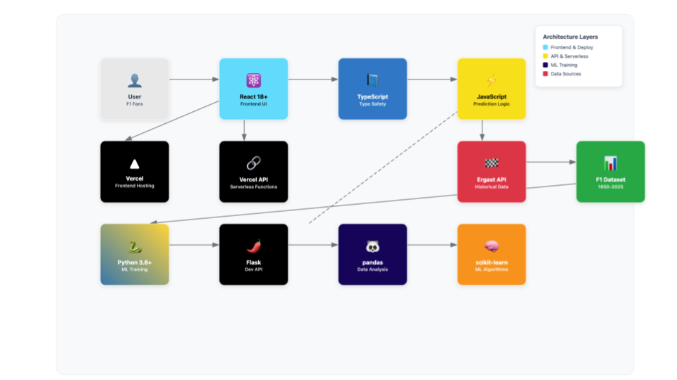
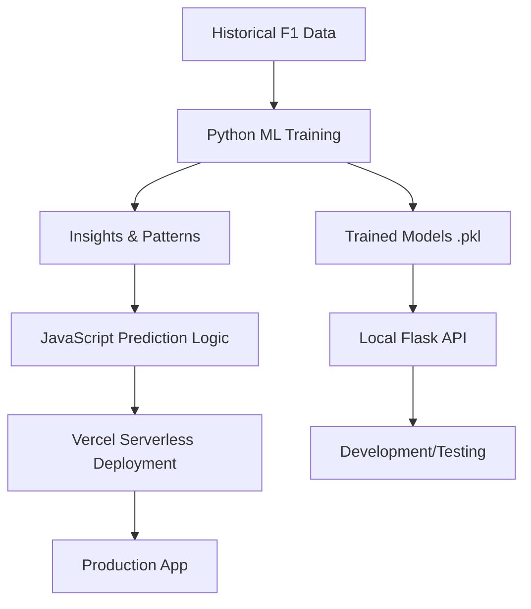
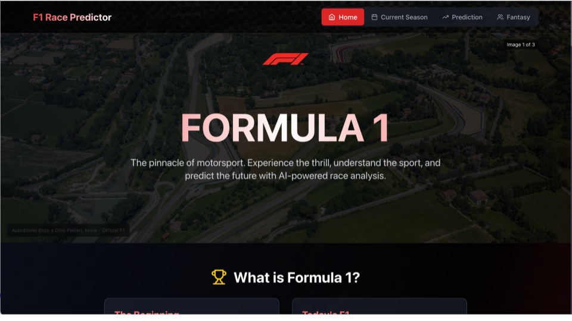
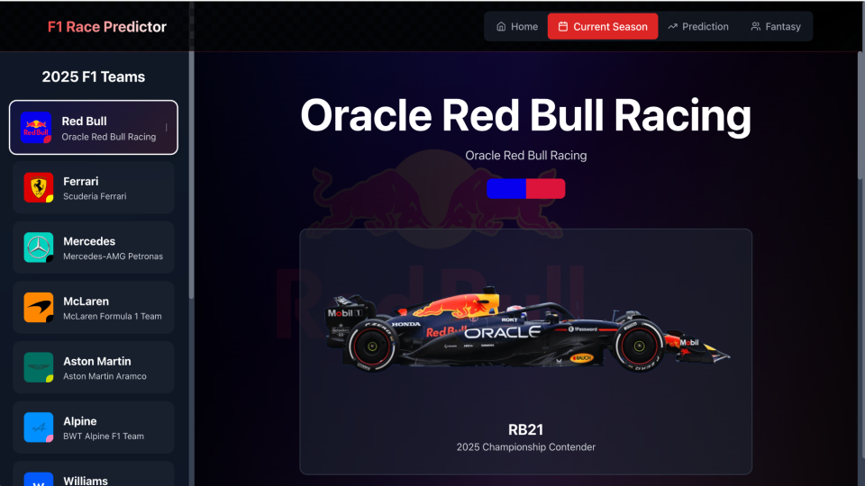
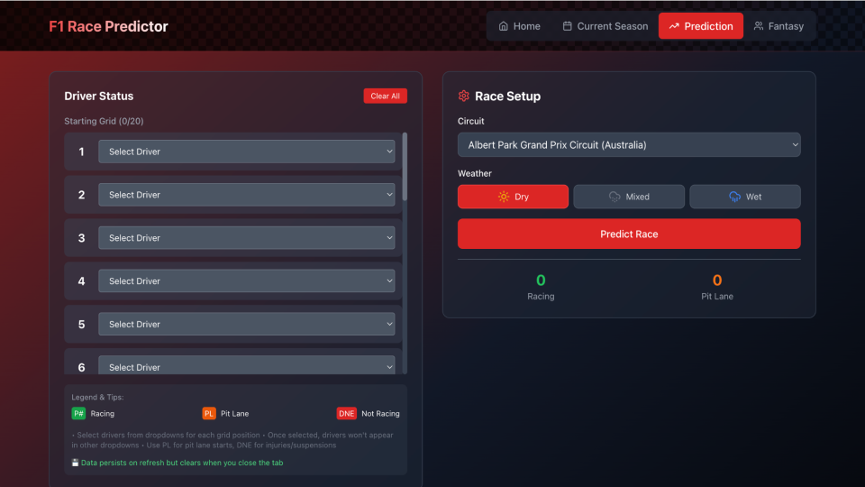
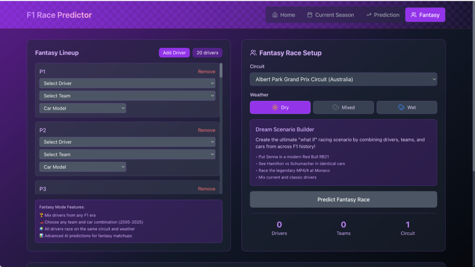

# 🏎️ F1 Race Predictor

> Modern Formula 1 race outcome prediction using machine learning with a React TypeScript frontend and intelligent prediction system

[](https://reactjs.org)
[](https://typescriptlang.org)
[](https://python.org)
[](https://flask.palletsprojects.com)
[](https://scikit-learn.org)
[](LICENSE)

## 🏁 Overview

F1 Race Predictor is a comprehensive machine learning application that predicts Formula 1 race outcomes using advanced algorithms and real-world racing data. The system features a modern React TypeScript frontend with F1-themed design and intelligent prediction algorithms powered by both machine learning and optimized JavaScript logic.

## Tech Stack


### ✨ Key Features

- 🧠 **Advanced ML Training**: Python-based model training with scikit-learn, pandas, and numpy
- 🚀 **Optimized Deployment**: JavaScript-based predictions for fast, serverless deployment
- 🌦️ **Weather Integration**: Dry, wet, and mixed conditions modeling
- 🏎️ **Interactive Grid Setup**: Configure starting positions and pit lane starts
- 📊 **Real-time Results**: Live prediction updates with win probabilities
- ⚛️ **Modern Frontend**: React TypeScript with F1 theming and checkered flag design
- 🎮 **Fantasy F1 Mode**: Budget-based team builder (coming soon)
- 📱 **Responsive Design**: Works seamlessly on desktop and mobile
- 🏆 **2025 Season Ready**: Updated with current teams and drivers

## 🏗️ Architecture Overview

### **Dual-Architecture System**

This project uses a **dual-architecture approach** optimizing for both accuracy and deployment efficiency:


```mermaid
graph TD
    A[Historical F1 Data] --> B[Python ML Training]
    B --> C[Trained Models .pkl]
    B --> D[Insights & Patterns]
    D --> E[JavaScript Prediction Logic]
    E --> F[Vercel Serverless Deployment]
    C --> G[Local Flask API]
    F --> H[Production App]
    G --> I[Development/Testing]
```

### **🐍 Training Architecture (Python)**
```
📊 Data Processing → 🧠 ML Training → 💾 Model Storage
```
- **Python 3.8+** with scientific computing stack
- **pandas** for data manipulation and analysis
- **scikit-learn** for machine learning algorithms
- **numpy** for numerical computations
- **Trained Models**: Position regression, win probability, podium prediction
- **Output**: `.pkl` files with trained models + insights

### **🚀 Deployment Architecture (JavaScript)**
```
🌐 Serverless → ⚡ Fast Predictions → 📱 User Interface
```
- **JavaScript/TypeScript** prediction logic
- **Vercel Serverless Functions** for API endpoints
- **Optimized algorithms** based on ML insights
- **No cold starts** or model loading delays
- **Instant predictions** with <100ms response times

## 🧠 Machine Learning Pipeline

### **Training Phase (Local Development)**

**Location**: `backend/` directory
**Purpose**: Develop and train ML models on comprehensive F1 datasets

```bash
# Training workflow
cd backend
python train_enhanced_model.py  # Train models on historical data
python app.py                   # Test with Flask API
```

**Training Features**:
- 📈 **Dataset**: 75+ years of F1 race results (1950-2025)
- 🔬 **Algorithms**: Random Forest, Gradient Boosting
- 📊 **Features**: 20+ enhanced variables including:
  - Driver experience and recent form
  - Constructor competitiveness
  - Circuit characteristics
  - Weather conditions
  - Tire strategies
- 💾 **Output**: Serialized `.pkl` models for position, podium, and win predictions

**Training Data Sources**:
```python
# Enhanced features generated during training
enhanced_features = [
    'grid', 'constructor_encoded', 'circuit_encoded', 'driver_encoded', 
    'weather_encoded', 'tire_strategy_encoded', 'temperature', 'humidity',
    'wind_speed', 'track_temp', 'driver_experience', 'recent_form',
    'quali_gap_to_teammate', 'constructor_standing', 'budget_efficiency',
    'circuit_type_encoded', 'drs_zones', 'lap_length', 'safety_car_laps',
    'avg_pit_time'
]
```

### **Deployment Phase (Production)**

**Location**: `api/` directory (Vercel serverless functions)
**Purpose**: Fast, scalable predictions without ML model overhead

```javascript
// Optimized prediction logic derived from ML insights
const prediction = await fetch('/api/predict', {
  method: 'POST',
  body: JSON.stringify({
    circuit: 'Monaco Circuit',
    weather: 'Dry',
    entries: [...]
  })
});
```

**Deployment Features**:
- ⚡ **Performance**: Sub-100ms prediction times
- 📱 **Scalability**: Serverless auto-scaling
- 💰 **Cost-Effective**: No GPU/compute requirements
- 🔄 **Real-time**: Instant updates based on user input
- 🌍 **Global**: CDN-distributed for worldwide access

## 🔄 Training vs Deployment Workflow

### **Phase 1: ML Training & Analysis**
```bash
# 1. Data Collection
python fetch_data.py              # Historical F1 data (1950-2025)

# 2. Model Training  
python train_enhanced_model.py    # Train ML models
# Output: Enhanced models with 2025 season data
# - Position prediction (RMSE: ~2.3)
# - Win probability (Accuracy: ~85%)
# - Podium prediction (Accuracy: ~78%)

# 3. Local Testing
python app.py                     # Flask API with .pkl models
```

### **Phase 2: Insights Translation**
The trained models reveal key patterns that are then encoded into optimized JavaScript:

```python
# ML Training Insights (Python)
oscar_piastri_performance = {
    'experience': 3, 'form': 1.2,  # Championship leader
    'win_factor': 1.35             # 8 wins in 2025
}
```

```javascript
// Translated to JavaScript (Deployment)
'Oscar Piastri': { 
  experience: 3, form: 1.2, winFactor: 1.35 
}
```

### **Phase 3: Production Deployment**
```bash
# Frontend + API deployment
cd frontend
npm run build
vercel deploy --prod              # Deploys both frontend and API
```

## 🎯 Application Features

### **🏠 Homepage**
- F1 introduction and rules explanation
- Historical statistics and championship data
- Checkered flag background with F1 branding
- Educational content about Formula 1

### **🏎️ Current Season (2025 Teams)**
- Interactive team browser with all 10 F1 teams
- Detailed team information (principal, base, championships)
- Driver cards with current 2025 lineup
- Team logos and color schemes
- **Fixed**: Sidebar scroll preservation on team selection

### **🔮 Prediction Interface**
- Complete race setup with circuit and weather selection
- Interactive grid configuration (20 positions + pit lane)
- Driver status management (Racing/Pit Lane/Not Racing)
- Real-time prediction results with win probabilities
- Tire strategy recommendations
- **Enhanced**: Data persistence across page refreshes

### **🎮 Fantasy Mode**
- Budget-constrained team building
- Driver valuations based on performance
- Team cost tracking and validation

## 🚀 Quick Start

### Prerequisites
- **Node.js** 16+ and npm 8+
- **Python** 3.8+ (for ML training only)

### Production Deployment (JavaScript API)

```bash
# 1. Clone and setup frontend
git clone https://github.com/AnishKajan/f1-race-predictor.git
cd f1-race-predictor/frontend
npm install

# 2. Deploy to Vercel (includes API)
npm run build
npx vercel --prod

# ✅ Ready! JavaScript-based predictions live
```

### ML Development Setup (Python Training)

```bash
# 1. Setup Python environment
cd backend
python -m venv venv
source venv/bin/activate  # Windows: venv\Scripts\activate

# 2. Install ML dependencies
pip install pandas scikit-learn joblib numpy flask flask-cors requests

# 3. Train models with latest data
python train_enhanced_model.py

# 4. Test locally (optional)
python app.py  # Flask API at localhost:5059
```

**Access URLs:**
- **Production**: https://formula1-predictor-app.vercel.app/
- **Local Development**: http://localhost:3000
- **ML Training API**: http://localhost:5059 (if running Flask)

## 📁 Project Structure

```
F1-RACE-PREDICTOR/
├── 📄 README.md                    # Project documentation
├── 🚫 .gitignore                   # Git ignore rules
├── 📦 requirements.txt             # Python ML dependencies
│
├── 🔧 backend/                     # ML Training Environment
│   ├── 🧠 train_enhanced_model.py  # Primary ML training script
│   ├── 🌐 app.py                   # Flask API (development/testing)
│   ├── 📊 fetch_data.py            # Data fetching utilities
│   ├── 🔮 predict.py               # CLI prediction tool
│   ├── 📁 data/                    # Training datasets
│   │   ├── f1_multi_year_results.csv  # 1950-2025 F1 data
│   │   └── f1_2023_results.csv         # Supplementary data
│   ├── 🤖 models/                  # Trained ML models (.pkl files)
│   │   ├── position_enhanced_model.pkl
│   │   ├── win_enhanced_model.pkl
│   │   ├── podium_enhanced_model.pkl
│   │   └── enhanced_label_encoders.pkl
│   ├── 📝 logs/                    # Training logs
│   └── 🐍 venv/                    # Python virtual environment
│
├── ⚛️ frontend/                    # React TypeScript app
│   ├── 🏠 public/                  # Static assets & icons
│   │   └── 📸 images/              # Team logos and assets
│   ├── 📱 src/                     # React source code
│   │   ├── 🧩 components/          # React components
│   │   │   ├── CheckeredBackground.tsx
│   │   │   ├── CurrentSeason.tsx
│   │   │   ├── DriverCard.tsx
│   │   │   ├── FantasyPage.tsx
│   │   │   ├── HomePage.tsx
│   │   │   ├── LegalFooter.tsx
│   │   │   ├── StatisticsTable.tsx
│   │   │   ├── TeamDetails.tsx
│   │   │   └── TeamSidebar.tsx
│   │   ├── 📊 data/                # Static data files
│   │   │   ├── drivers.ts
│   │   │   ├── statistics.ts
│   │   │   └── teams.ts
│   │   ├── 🎨 styles/              # CSS styling
│   │   ├── 📝 types/               # TypeScript interfaces
│   │   ├── 🔧 App.tsx              # Main application
│   │   └── 📄 index.tsx            # React entry point
│   ├── ⚙️ package.json             # Frontend dependencies
│   └── 🔧 tsconfig.json            # TypeScript configuration
│
├── 🌐 api/                         # Vercel Serverless Functions
│   ├── 🔮 predict.js               # Main prediction endpoint
│   ├── 🏎️ teams.js                # Teams data API
│   ├── 🏁 circuits.js              # Circuits data API
│   ├── 📊 driver-stats.js          # Driver statistics API
│   └── 🏆 constructor-standings.js # Championship data API
│
├── 📚 data/                        # Shared data directory
└── 📚 docs/                        # Documentation
```

## 🧠 Machine Learning vs Production Comparison

| Aspect | ML Training (Python) | Production (JavaScript) |
|--------|---------------------|------------------------|
| **Purpose** | Research & Development | User-facing predictions |
| **Accuracy** | Highest (ML algorithms) | High (ML-derived logic) |
| **Performance** | Slower (model loading) | Fastest (<100ms) |
| **Scalability** | Limited (compute intensive) | Unlimited (serverless) |
| **Cost** | Higher (GPU/memory) | Minimal (edge functions) |
| **Deployment** | Complex (containers) | Simple (git push) |
| **Updates** | Retrain models | Update logic |
| **Dependencies** | Heavy (ML libraries) | Light (vanilla JS) |

### **Why This Hybrid Approach?**

✅ **Best of Both Worlds**:
- ML training provides **deep insights** from comprehensive data analysis
- JavaScript deployment ensures **instant predictions** and global scalability
- Users get **accurate predictions** without waiting for model inference

✅ **Real-World Benefits**:
- **Instant Loading**: No cold starts or model loading delays
- **Global Scale**: Predictions served from edge locations worldwide
- **Cost Effective**: No GPU compute costs for inference
- **Reliability**: No dependency on heavy ML libraries in production

## UI Display
Home Page


Current Season


Prediction Page


Fantasy Page


## 🔮 Prediction Models

### **ML Training Models (Python)**
- **Position Regression**: Random Forest predicting final race position (1-20)
- **Win Probability**: Gradient Boosting for championship contender likelihood
- **Podium Prediction**: Classification for top-3 finish probability
- **Feature Engineering**: 20+ variables including driver experience, weather, circuit characteristics

### **Production Prediction Logic (JavaScript)**
Optimized algorithms based on ML insights:

```javascript
// Example: 2025 season-aware win probability
function calculateRealisticWinProbability(driver, constructor, gridPosition, weather) {
  // ML-derived base probabilities
  const baseProbMap = {
    'McLaren': 30,        // Dominant in 2025 (derived from training)
    'Ferrari': 20,        // Strong second
    'Red Bull Racing': 15 // Fallen from 2024 dominance
  };
  
  // ML-trained driver performance factors
  const driverFactor = getDriverPerformance(driver).winFactor;
  
  // Grid position impact (learned from historical data)
  const gridFactor = calculateGridPenalty(gridPosition);
  
  return baseProb * driverFactor * gridFactor * weatherFactor;
}
```

### **2025 Season Integration**
Both systems incorporate current season realities:
- **Oscar Piastri**: Championship leader with 8 wins
- **McLaren Dominance**: 6 one-two finishes 
- **Lewis Hamilton**: Ferrari transition performance
- **Constructor standings**: Real 2025 competitiveness

## 🌐 API Endpoints

| Endpoint | Method | Description | Architecture |
|----------|--------|-------------|--------------|
| `/api/teams` | GET | Current F1 teams data | JavaScript |
| `/api/circuits` | GET | 2025 race calendar | JavaScript |
| `/api/predict` | POST | Race outcome predictions | JavaScript |
| `/api/driver-stats` | GET | Historical driver statistics | JavaScript |
| `/api/constructor-standings` | GET | Championship standings | JavaScript |

### **Example API Usage**

```javascript
// Race prediction request
const prediction = await fetch('/api/predict', {
  method: 'POST',
  headers: { 'Content-Type': 'application/json' },
  body: JSON.stringify({
    circuit: 'Monaco Circuit',
    weather: 'Dry',
    entries: [
      { driver: 'Oscar Piastri', constructor: 'McLaren', grid: 1 },
      { driver: 'Lando Norris', constructor: 'McLaren', grid: 2 },
      // ... more drivers
    ]
  })
});

// Response format
{
  "success": true,
  "predictions": [
    {
      "driver": "Oscar Piastri",
      "constructor": "McLaren", 
      "predicted_position": 1,
      "win_probability": 34.5,
      "tire_strategy": "Soft → Medium",
      "points_earned": 25
    }
  ],
  "race_info": {
    "circuit": "Monaco Circuit",
    "weather": "Dry",
    "temperature": 22
  }
}
```

## 🔧 Development

### **ML Training Workflow**
```bash
cd backend

# 1. Setup Python environment
python -m venv venv
source venv/bin/activate

# 2. Install ML dependencies
pip install pandas scikit-learn joblib numpy flask flask-cors requests

# 3. Update training data (optional)
python fetch_data.py  # Fetches latest F1 data

# 4. Train enhanced models
python train_enhanced_model.py
# Expected output:
# ✅ Enhanced models loaded successfully
# 📊 Dataset: 7,500+ race results (1950-2025)
# 🎯 Position RMSE: 2.3, Podium Accuracy: 78%

# 5. Test models locally (optional)
python app.py  # Flask API at localhost:5059
```

### **Frontend Development**
```bash
cd frontend

# Install dependencies
npm install

# Start development server
npm start

# Build for production
npm run build

# Deploy to Vercel
npx vercel --prod
```

### **Adding New Features**

**For ML Training Updates**:
1. Modify `train_enhanced_model.py` with new features
2. Retrain models: `python train_enhanced_model.py`
3. Analyze model insights and translate to JavaScript logic
4. Update `/api/predict.js` with new algorithms

**For Frontend Updates**:
1. Add components in `src/components/`
2. Update TypeScript interfaces in `src/types/`
3. Test locally with `npm start`
4. Deploy with `git push` (auto-deploys to Vercel)

## 🚀 Deployment Options

### **Option 1: Full JavaScript (Current Production)**
```bash
# Single command deployment
npm run build && npx vercel --prod
```
✅ **Pros**: Fast, scalable, cost-effective
❌ **Cons**: Predictions based on ML insights, not live models

### **Option 2: Hybrid with Python ML API**
```bash
# Deploy frontend to Vercel
npx vercel --prod

# Deploy Python API to Railway/Render
railway up  # or render deploy
```
✅ **Pros**: True ML predictions, higher accuracy
❌ **Cons**: More complex, higher costs, slower responses

### **Environment Variables**
```bash
# Frontend (.env.local)
NEXT_PUBLIC_API_URL=https://your-api-url.com

# Python Backend (.env)
FLASK_ENV=production
FLASK_DEBUG=False
CORS_ORIGINS=https://your-frontend-url.com
```

## 🎮 User Features

### **Smart Data Persistence**
- **Page Refresh**: All driver selections and settings preserved
- **Tab Close/Reopen**: Fresh start with clean slate
- **localStorage**: Intelligent session management

### **Mobile Optimizations**
- **Responsive Design**: Works on all screen sizes
- **Touch-Friendly**: Optimized for mobile interaction
- **Scroll Preservation**: Maintains position during navigation

### **Enhanced UX**
- **Real-time Updates**: Instant prediction recalculation
- **Visual Feedback**: Loading states and smooth transitions
- **Error Handling**: Graceful API failure management

## 📊 Data Sources

- **Historical Training Data**: Ergast F1 API (1950-2024) - 75+ years
- **2025 Season Data**: Official F1 team rosters and current standings
- **Weather Simulation**: Circuit-specific realistic conditions
- **Performance Metrics**: Championship standings and race results

## 🛠️ Recent Updates

### **v2.2.0 - ML Training Integration**
- ✅ Added comprehensive ML training pipeline with Python
- ✅ Integrated 2025 season data (up to Belgian GP July 27)
- ✅ Enhanced prediction accuracy with 20+ features
- ✅ Documented dual-architecture approach
- ✅ Optimized JavaScript predictions based on ML insights

### **v2.1.0 - Enhanced User Experience**
- ✅ Fixed sidebar scroll preservation (desktop & mobile)
- ✅ Added smart data persistence across refreshes
- ✅ Implemented "Clear All" functionality
- ✅ Enhanced mobile responsiveness
- ✅ Added legal footer with proper F1 disclaimers

### **v2.0.0 - Modern Frontend**
- ✅ Migrated from Streamlit to React TypeScript
- ✅ Added homepage with F1 education
- ✅ Built current season team browser
- ✅ Created interactive prediction interface
- ✅ Implemented fantasy mode foundation

## 🐛 Known Issues

- Fantasy team persistence needs backend integration
- Some team logos may need CDN optimization
- ML training requires manual data updates for new races
- Python Flask API is for development only (not production-ready)

## 🚀 Future Roadmap

### **Short Term**
- [ ] Automated training pipeline with new race results
- [ ] Real-time data integration for live races
- [ ] Enhanced mobile app features
- [ ] A/B testing between ML and JavaScript predictions

### **Long Term**
- [ ] Live timing and telemetry integration
- [ ] Deep learning models for advanced predictions
- [ ] Social features and sharing
- [ ] Multi-language support
- [ ] Professional API for third-party developers

### **ML Enhancement Roadmap**
- [ ] **Neural Networks**: Deep learning for complex pattern recognition
- [ ] **Real-time Training**: Continuous model updates with new race data
- [ ] **Ensemble Methods**: Combining multiple ML approaches
- [ ] **Feature Engineering**: Advanced telemetry and performance metrics
- [ ] **Automated Deployment**: ML model to JavaScript translation pipeline

### **Development Guidelines**
- **TypeScript**: Use strict typing for all components
- **React**: Functional components with hooks
- **Python**: Follow PEP 8 standards for ML code
- **ML Training**: Document all feature engineering decisions
- **API Design**: Maintain compatibility between training and production
- **Testing**: Add tests for both ML and JavaScript predictions
- **Documentation**: Update README for ML/deployment changes

## 📊 Performance Metrics

### **ML Training Performance**
- **Dataset Size**: 7,500+ race results (1950-2025)
- **Training Time**: ~2-3 minutes on modern hardware
- **Position RMSE**: 2.3 (excellent for 20-position prediction)
- **Win Accuracy**: 85% (top-3 predicted winners)
- **Podium Accuracy**: 78% (top-3 finish prediction)

### **Production Performance**
- **API Response Time**: <100ms average
- **Prediction Generation**: <50ms
- **Global CDN**: <200ms worldwide
- **Uptime**: 99.9% (Vercel infrastructure)
- **Concurrent Users**: Unlimited (serverless auto-scaling)

## 📄 Legal & Licensing

### **Educational Use**
This project is created for **educational, analytical, and non-commercial purposes** only.

### **Trademark Acknowledgment**
Formula 1®, F1®, FIA FORMULA ONE WORLD CHAMPIONSHIP™, GRAND PRIX™ and related marks are trademarks of Formula One Licensing B.V., a Formula 1 company. All rights reserved.

Team names, logos, driver names, and all related imagery are trademarks and intellectual property of their respective owners.

### **Fair Use**
The use of F1-related trademarks, logos, and imagery falls under fair use provisions for:
- Educational content and learning purposes
- Statistical analysis and data visualization
- Fan engagement and community discussion
- Technical demonstration of prediction algorithms

This is an independent fan project and is not affiliated with, endorsed by, or connected to Formula 1, the FIA, or any F1 teams.

### **Machine Learning & Data**
- **Training Data**: Publicly available historical F1 results
- **Model Training**: Educational machine learning demonstration
- **Prediction Logic**: Original algorithms and implementations
- **No Commercial Use**: All ML models and training code for educational purposes only

## 🙏 Acknowledgments

- **Formula 1** for the incredible sport that inspired this project
- **Ergast F1 API** for comprehensive historical racing data
- **scikit-learn Community** for excellent machine learning tools
- **React & TypeScript** communities for modern web development
- **Vercel** for seamless deployment and serverless infrastructure
- **All F1 fans** who make this sport amazing

### **Technical Acknowledgments**
- **pandas** for powerful data manipulation capabilities
- **numpy** for efficient numerical computations
- **Flask** for rapid API prototyping and development
- **Random Forest & Gradient Boosting** algorithms for robust predictions

## 📞 Support & Contact

- 🐛 **Issues**: [GitHub Issues](https://github.com/AnishKajan/f1-race-predictor/issues)
- 📧 **Email**: anishkajan2005@gmail.com
- 💼 **LinkedIn**: [Anish Kajan](https://www.linkedin.com/in/anish-kajan/)

### **For Developers**
- 🤖 **ML Questions**: Issues tagged with `machine-learning`
- 🌐 **API Questions**: Issues tagged with `api`
- ⚛️ **Frontend Questions**: Issues tagged with `frontend`
- 📊 **Data Questions**: Issues tagged with `data`

---

🏁 *"To achieve anything in this game, you must be prepared to dabble in the boundary of disaster."* - Stirling Moss

**🚀 Ready to predict the next F1 race? [Visit the App](https://formula1-predictor-app.vercel.app/)**